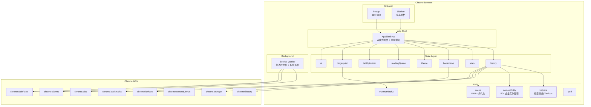
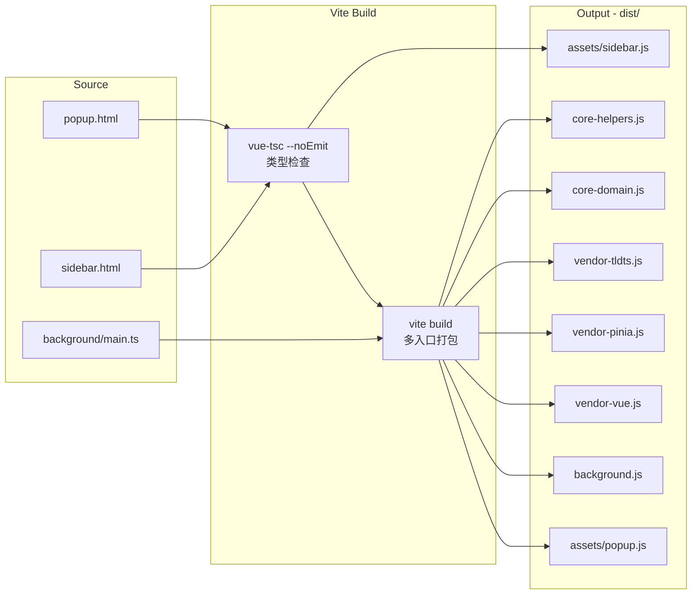
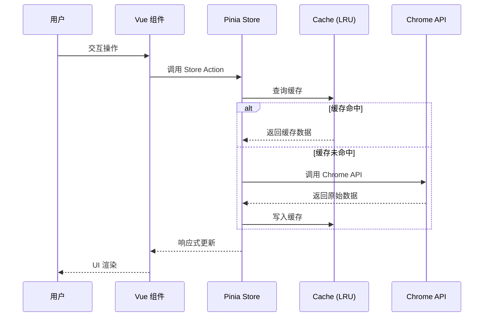

<div align="center">

# 🌐 浏览器历史记录管理器

**Browser History Manager — 重新定义你的浏览数据体验**

[](https://vuejs.org/)
[](https://www.typescriptlang.org/)
[](https://vitejs.dev/)
[](https://developer.chrome.com/docs/extensions/)
[](https://pinia.vuejs.org/)
[](https://unocss.dev/)
[](LICENSE)

一款基于 Chrome Manifest V3 的专业级浏览器扩展——不只是历史记录管理，更是你的浏览数据智能分析中心。

[功能特性](#-功能特性) · [快速开始](#-快速开始) · [开发指南](#-开发指南) · [贡献指南](#-贡献指南)

</div>

---

## 📑 目录

- [项目概述](#-项目概述)
- [功能特性](#-功能特性)
- [技术栈](#-技术栈)
- [快速开始](#-快速开始)
- [使用指南](#-使用指南)
- [项目结构](#-项目结构)
- [技术架构](#-技术架构)
- [Chrome API 集成](#-chrome-api-集成)
- [安全设计](#-安全设计)
- [开发指南](#-开发指南)
- [贡献指南](#-贡献指南)
- [常见问题](#-常见问题)
- [许可证](#-许可证)

---

## 🎯 项目概述

**浏览器历史记录管理器**是一款基于 Chrome Manifest V3 的专业级历史记录管理扩展。它不仅提供高效的历史记录检索与管理能力，还集成了智能标签系统、深度数据统计、浏览 DNA 分析、标签页内存优化、阅读队列等功能，帮助用户全面掌控浏览数据、提升浏览效率。

**核心价值**：

| 维度 | 能力 | 说明 |
|------|------|------|
| 🔍 精准检索 | 多维筛选 + 全文搜索 + 智能分组 | 秒级定位任意历史记录 |
| 🏷️ 智能标签 | 30+ 自动分类规则 | 零配置即可识别社交/视频/技术/购物等类别 |
| 📊 深度洞察 | 热力图 + 生产力评分 + 浏览节律 | 全面了解你的浏览习惯 |
| 🧬 浏览 DNA | 8 维硬件指纹 + 22 维行为维度 | 生成独一无二的浏览身份标识 |
| 🧠 内存优化 | 自动休眠 + 重复检测 | 降低浏览器内存占用 |
| 🎨 高度定制 | 8 预设 + 9 渐变 + 自定义配色 | 布局/排版/效果全可调 |
| 🔒 隐私安全 | 零第三方传输 + URL 脱敏 + CSP | 数据仅存于本地 |

---

## ✨ 功能特性

### 历史记录管理

| 功能 | 说明 |
|------|------|
| 时间筛选 | 今日 / 昨天 / 3天 / 7天 / 30天 / 季度 / 年 / 全部 |
| 分组模式 | 按域名 / 按时间线 / 按会话（30 分钟间隔）/ 自定义规则 |
| 排序方式 | 时间升降 / 访问次数升降 / 域名升降 |
| 全文搜索 | 标题 + 网址 + 域名关键词匹配，搜索高亮 |
| 收藏标记 | 快速收藏重要记录，独立筛选查看 |
| 批量操作 | 多选删除、批量标签、批量收藏 |
| 域名黑名单 | 过滤不想看到的网站 |
| CSV 导出 | 导出记录，敏感参数（token/session 等 32 种）自动脱敏 |
| 分页加载 | 可配置每页条数（默认 100），大数据量下流畅滚动 |
| 后台加载 | 首次加载 5000 条，后台自动加载至 15000 条 |

### 智能自动标签系统

基于 30+ 分类规则的多维度匹配引擎，零配置自动识别：

- **匹配维度**：精确域名 / 域名后缀 / URL 路径 / 查询参数 / 标题关键词 / URL 语义模式 / 域名实体传播 / 域名特征分类
- **置信度评分**：0-1 浮点评分，区分强匹配（0.95 精确域名）与弱匹配（0.3 标题关键词）
- **分类覆盖**：social, video, tech, docs, shopping, news, design, learning, email, music, ai, gaming, finance, blog, forum, tools, cloud, health, travel, food 等 30+ 类别
- **子标签系统**：40+ 子标签规则（frontend / backend / competitiveProgramming / devOps / shortVideo / longVideo / liveStream 等）
- **情境标签**：深夜浏览、长文阅读、深层页面等时间与内容维度标签
- **生产力分类**：productive / neutral / unproductive 三级
- **标签缓存**：最大 10000 条缓存，避免重复计算

### 数据统计与洞察

| 分析维度 | 功能 |
|----------|------|
| 访问概览 | 总访问量 / 本周访问 / 日均 / 独立网站数 |
| 热门网站 | TOP 10 轮播展示 |
| 访问趋势 | 本周每日柱状图 |
| 分类统计 | 8 大类别占比（社交/视频/技术/购物/新闻/开发/学习/娱乐） |
| 热力图 | 7×24 时段访问热力分布 |
| 生产力评分 | 高效 / 良好 / 一般 / 需改善 四级评定 |
| 浏览节律 | 峰值时段识别 + 会话模式分类（规律型/夜猫型/工作型/碎片型） |
| 兴趣趋势 | 周环比变化追踪（rising / falling / stable） |
| 情境推荐 | 基于当前时段推荐常浏览网站 |
| 智能推荐 | 综合频率(0.2) + 时效(0.2) + 时段(0.25) + 周期(0.15) + 习惯(0.2) 五因子推荐 |

### 浏览 DNA 分析

基于硬件指纹 + 行为维度的浏览身份标识系统：

**硬件指纹采集**（8 个维度）：

| 维度 | 权重 | 采集方式 |
|------|------|----------|
| Canvas | 0.18 | 绘制文本+渐变+圆形，区域哈希对比 |
| WebGL | 0.16 | 渲染器信息 + 扩展列表 + 场景渲染哈希 |
| Audio | 0.14 | OfflineAudioContext 三角波+压缩器，采样哈希 |
| Fonts | 0.12 | 30 种字体宽度检测（含中文字体） |
| WASM | 0.12 | WebAssembly 特性探测 |
| Display | 0.10 | 分辨率/色深/像素比/方向 |
| System | 0.10 | CPU 核心数/内存/平台/触控点 |
| Locale | 0.08 | 语言/时区/格式化特征 |

**行为维度计算**（22 个维度）：

- **内容维度**（8 个）：生产力比率、娱乐比率、内容比率、知识深度、多样性指数、探索广度、专注度、忠诚度
- **兴趣维度**（4 个）：好奇心、稳定性、变化频率、趋势动量
- **交互维度**（8 个）：夜猫指数、晨间指数、节律性、强度、社交参与度、会话广度、互动性、会话一致性
- **实体维度**（2 个）：实体多样性、实体集中度

**原型匹配**（8 种原型，余弦相似度匹配）：学者、探索者、专家、社交者、创作者、消费者、夜猫子、规律型

**SuperDNA 融合**：硬件哈希 + 行为哈希 → MurmurHash3 → 唯一 ID，含稳定性追踪和变化检测

### 标签页管理（Sidebar 专属）

- 标签页列表展示，显示内存占用估算（每标签约 50MB）
- **重复标签检测**：基于 `origin + pathname` 去重，一键关闭重复页面
- **空闲标签休眠**：可配置超时时间（默认 30 分钟），自动 `chrome.tabs.discard()` 释放内存
- **保护机制**：固定标签 / 有声标签 / 活跃标签不受休眠影响
- **定时检查**：Background Service Worker 每 5 分钟自动巡检（chrome.alarms）
- **最小活跃标签数**：默认 5，低于此数不执行休眠

### 阅读队列

- 一键添加感兴趣的文章到阅读队列
- 智能优先级排序（基于内容类型权重 0.6 + 时效性权重 0.4）
- 持久化存储（通过 appCache），跨会话保留
- 自动识别技术文章/博客/教程等关键词提升优先级

### 主题系统

| 配置项 | 选项 |
|--------|------|
| 外观模式 | 跟随系统 / 浅色 / 深色 |
| 预设主题 | 靛蓝 / 翡翠 / 玫瑰 / 琥珀 / 青蓝 / 紫罗兰 / 石墨 / 粉樱 |
| 渐变主题 | 海洋 / 日落 / 森林 / 夜晚 / 火焰 / 极光 / 薰衣草 / 冰川 / 沙漠 |
| 自定义颜色 | 主色调 / 背景色 / 文字色（Color Picker） |
| 强调色 | 独立设置，影响按钮/标签/聚焦框/选中态 |
| 圆角风格 | 无 / 小 / 中 / 大 |
| 字号 | 小 (12px) / 中 (13px) / 大 (14px) |
| 字体族 | 系统默认 / 衬线体 / 等宽体 / 圆体 |
| 头部风格 | 实色 / 渐变 / 毛玻璃 / 极简 |
| 卡片风格 | 扁平 / 描边 / 阴影 / 悬浮 |
| 动画速度 | 关闭 / 慢 (250ms) / 正常 (120ms) / 快 (60ms) |
| 滚动条 | 纤细 / 标准 / 隐藏 |
| 背景纹理 | 无 / 点阵 / 网格 / 斜线 / 噪点 |
| 紧凑模式 | 减小间距，提升信息密度 |
| 导入/导出 | JSON 格式，含校验 |
| 重置 | 一键恢复默认 |

### 命令面板

`Ctrl+K` 快速唤起，支持搜索历史记录、切换视图、执行操作。

### 预览面板

侧滑预览面板，无需跳转即可查看记录详情，URL 敏感参数自动脱敏显示。

---

## 🛠 技术栈

| 技术 | 版本 | 用途 |
|------|------|------|
| [Vue 3](https://vuejs.org/) | ^3.4 | 响应式 UI 框架（Composition API + `<script setup>`） |
| [TypeScript](https://www.typescriptlang.org/) | ^5.4 | 类型安全（`strict: true` 严格模式） |
| [Vite](https://vitejs.dev/) | ^5.1 | 构建工具（多入口打包，target: chrome120） |
| [Pinia](https://pinia.vuejs.org/) | ^2.1 | 状态管理（8 个 Store） |
| [UnoCSS](https://unocss.dev/) | ^0.58 | 原子化 CSS（preset-uno + preset-icons + transformer-directives） |
| [Lucide](https://lucide.dev/) | ^1.1 | 图标库（通过 @iconify-json/lucide） |
| [tldts](https://github.com/remusao/tldts) | ^7.0 | 域名解析（注册域名/公共后缀/子域名提取） |
| Chrome Extension MV3 | — | 扩展平台（Manifest V3，最低 Chrome 120） |

---

## 🚀 快速开始

### 环境要求

| 依赖 | 最低版本 | 安装方式 |
|------|----------|----------|
| [Node.js](https://nodejs.org/) | >= 18.0 | 官网下载或 `nvm install 18` |
| npm | >= 9.0 | 随 Node.js 安装 |
| [Chrome](https://www.google.com/chrome/) | >= 120 | 官网下载 |

### 安装

```bash
# 克隆项目（请替换为实际仓库地址）
git clone https://github.com/<username>/browser-history-manager.git
cd "Browser History"

# 安装依赖
npm install

# 构建生产版本
npm run build
```

### 加载扩展

1. 运行 `npm run build`，产物输出到 `dist/` 目录
2. 打开 Chrome，地址栏输入 `chrome://extensions/`
3. 右上角开启 **开发者模式**
4. 点击 **加载已解压的扩展程序**
5. 选择项目的 `dist` 目录
6. 扩展图标出现在工具栏 🎉

> **验证安装**：点击扩展图标，若弹出历史记录管理窗口则安装成功。

---

## 📖 使用指南

### 双模式运行

本扩展支持两种运行模式，共享同一套核心逻辑：

| 模式 | 入口 | 尺寸 | 可用视图 |
|------|------|------|----------|
| **Popup** | 点击扩展图标 | 380×580 固定窗口 | 历史 / 统计 / 书签 / 设置 |
| **Sidebar** | 右键图标 → 在侧边栏中打开 | 浏览器全高侧栏 | 历史 / 统计 / 书签 / 设置 / **标签页管理** |

### 快捷操作

| 快捷键 | 功能 |
|--------|------|
| `Ctrl+K` | 唤起命令面板（搜索记录、切换视图、执行操作） |
| 右键扩展图标 | 打开侧边栏 / 选项菜单 |

### 典型工作流

**1. 查找历史记录**

```
点击扩展图标 → 时间筛选（如"最近7天"）→ 输入关键词搜索 → 按域名分组浏览
```

**2. 分析浏览习惯**

```
切换到"统计"视图 → 查看热力图和生产力评分 → 了解浏览节律 → 获取智能推荐
```

**3. 优化内存占用**（Sidebar 模式）

```
打开侧边栏 → 切换到"标签页"视图 → 检测重复标签 → 一键关闭 → 查看内存释放
```

**4. 个性化主题**

```
设置页 → 主题设置 → 选择预设/渐变/自定义 → 调整圆角/字号/动画 → 导出配置
```

---

## 📁 项目结构

```
Browser History/
├── public/
│   ├── _locales/                      # Chrome i18n 国际化
│   │   ├── en/messages.json
│   │   └── zh_CN/messages.json
│   ├── icons/                         # 扩展图标资源
│   └── manifest.json                  # Chrome 扩展清单 (MV3)
├── src/
│   ├── background/
│   │   └── main.ts                    # Service Worker
│   ├── components/business/           # 业务组件
│   │   ├── BookmarkPickerModal.vue
│   │   ├── BrowsingDNA.vue
│   │   ├── CommandPalette.vue
│   │   ├── ContextMenu.vue
│   │   ├── DeleteConfirmModal.vue
│   │   ├── EnhancedCharts.vue
│   │   ├── GalleryCard.vue
│   │   ├── GroupRuleModal.vue
│   │   ├── PreviewPanel.vue
│   │   ├── SmartAssistant.vue
│   │   ├── SmartTimeline.vue
│   │   ├── TagModal.vue
│   │   └── ThemeModal.vue
│   ├── composables/
│   │   ├── useFingerprint.ts          # 浏览器指纹采集
│   │   └── useStatsNavigation.ts      # 统计页面导航逻辑
│   ├── i18n/
│   │   ├── index.ts                   # i18n 核心（自实现）
│   │   └── locales/
│   │       ├── en.ts
│   │       └── zh-CN.ts
│   ├── popup/
│   │   ├── App.vue
│   │   └── main.ts                    # Popup 入口
│   ├── sidebar/
│   │   ├── index.html
│   │   └── main.ts                    # Sidebar 入口
│   ├── stores/                        # Pinia 状态仓库（8 个）
│   │   ├── bookmarks.ts
│   │   ├── fingerprint.ts
│   │   ├── history.ts
│   │   ├── readingQueue.ts
│   │   ├── stats.ts
│   │   ├── tabOptimizer.ts
│   │   ├── theme.ts
│   │   └── ui.ts
│   ├── styles/
│   │   └── main.css                   # 全局样式 & CSS 设计令牌
│   ├── types/
│   │   └── fingerprint.ts
│   ├── utils/
│   │   ├── cache.ts                   # LRU 缓存（内存 + chrome.storage 持久化）
│   │   ├── domainEntity.ts            # 域名实体图谱（50+ 企业实体）
│   │   ├── helpers.ts                 # 核心工具函数
│   │   ├── murmurHash3.ts             # MurmurHash3 哈希算法
│   │   └── perf.ts                    # 性能度量工具
│   ├── views/                         # 页面视图
│   │   ├── BookmarksView.vue
│   │   ├── HistoryView.vue
│   │   ├── SettingsView.vue
│   │   ├── StatsView.vue
│   │   └── TabManagerView.vue
│   ├── AppShell.vue                   # 应用外壳（Popup + Sidebar 双模式）
│   └── env.d.ts
├── popup.html                         # Popup 入口 HTML
├── sidebar.html                       # Sidebar 入口 HTML
├── vite.config.ts                     # Vite 构建配置
├── tsconfig.json                      # TypeScript 配置
├── tsconfig.node.json
├── uno.config.ts                      # UnoCSS 配置
└── package.json
```

---

## 🏛 技术架构

### 系统架构



### 构建架构



### 数据流



---

## 🔌 Chrome API 集成

本项目所有数据来源于 Chrome Extension APIs，无任何后端服务：

| Chrome API | 权限 | 用途 |
|------------|------|------|
| `chrome.history` | `history` | 搜索/删除历史记录 |
| `chrome.storage.local` | `storage` | 持久化存储（主题/收藏/标签/设置/缓存等） |
| `chrome.bookmarks` | `bookmarks` | 读取/删除书签树 |
| `chrome.tabs` | `tabs` | 查询/关闭/休眠标签页 |
| `chrome.sidePanel` | `sidePanel` | 侧边栏控制 |
| `chrome.contextMenus` | `contextMenus` | 右键菜单注册 |
| `chrome.alarms` | `alarms` | 定时任务（标签页巡检，5 分钟间隔） |
| `chrome.runtime` | — | 消息通信（sidebarMode 切换） |
| `chrome.favicon` | `favicon` | Favicon 获取（零网络请求） |

Background Service Worker 通过 `chrome.runtime.onMessage` 处理三种消息：

| 消息类型 | 说明 |
|----------|------|
| `updateSidebarMode` | 切换 Popup/Sidebar 模式 |
| `openSidePanel` | 打开侧边栏 |
| `autoSuspendCheck` | 执行标签页自动休眠检查 |

---

## 🔒 安全设计

| 措施 | 说明 |
|------|------|
| CSP 策略 | `script-src 'self'; object-src 'none'; style-src 'self' 'unsafe-inline'`，禁止外部脚本和插件 |
| Favicon 获取 | Chrome 原生 `favicon` 权限 + `/_favicon/` 端点，零网络请求 |
| URL 脱敏 | `sanitizeUrl()` 自动剥离 32 种敏感查询参数（token/session/password/key 等） |
| 存储安全 | `urlStorageKey()` 使用脱敏 URL 作为存储键 |
| 零第三方 | 无任何第三方数据传输，所有数据仅存于本地 `chrome.storage` |
| 生产构建 | 移除所有 `console.log` / `console.info` / `console.debug` 输出 |

<details>
<summary>📋 脱敏参数完整列表（32 种）</summary>

`token`, `access_token`, `refresh_token`, `auth`, `authorization`, `session`, `session_id`, `sessionid`, `sid`, `key`, `api_key`, `apikey`, `secret`, `password`, `passwd`, `pass`, `credential`, `private_key`, `signature`, `sign`, `hash`, `jwt`, `id_token`, `code`, `auth_code`, `verify`, `nonce`, `state`, `csrf`, `xsrf`, `ticket`

</details>

---

## 💻 开发指南

### 脚本命令

| 命令 | 说明 |
|------|------|
| `npm run dev` | 启动 Vite 开发服务器（热更新） |
| `npm run build` | TypeScript 类型检查 + 生产构建 |
| `npm run typecheck` | 仅执行类型检查 |
| `npm run preview` | 预览构建产物 |

### 开发流程

```bash
# 1. 启动开发服务器
npm run dev

# 2. 首次加载扩展
#    Chrome → chrome://extensions/ → 开发者模式 → 加载已解压的扩展程序 → 选择 dist/

# 3. 修改代码后，在 chrome://extensions/ 页点击刷新按钮

# 4. 完成开发后验证构建
npm run build
```

### 关键设计决策

| 决策 | 原因 |
|------|------|
| 自实现 i18n | 避免 vue-i18n 的运行时开销，扩展体积敏感 |
| MurmurHash3 自实现 | 零依赖，用于指纹 ID 生成和缓存键 |
| LRU 双层缓存 | 内存缓存（500 条，30 分钟 TTL）+ chrome.storage 持久化（1 小时 TTL） |
| 异步组件加载 | 所有视图通过 `defineAsyncComponent` 按需加载 |
| 手动分块 | tldts / pinia / vue 独立分块，优化缓存命中率 |
| 双模式共享 AppShell | Popup 与 Sidebar 通过路径检测切换，复用全部业务逻辑 |

---

## 🤝 贡献指南

感谢你对本项目的关注！详细的贡献指南请参阅 [CONTRIBUTING.md](CONTRIBUTING.md)。

### 快速开始

1. Fork 本仓库 → 创建功能分支 → 提交 PR
2. 遵循 [Conventional Commits](https://www.conventionalcommits.org/) 规范
3. 通过 `npm run build` 无错误

### 行为准则

本项目采用 [Contributor Covenant](https://www.contributor-covenant.org/) 行为准则，详见 [CODE_OF_CONDUCT.md](CODE_OF_CONDUCT.md)。

### Commit 规范

| 前缀 | 用途 |
|------|------|
| `feat:` | 新功能 |
| `fix:` | Bug 修复 |
| `perf:` | 性能优化 |
| `refactor:` | 代码重构 |
| `style:` | 样式调整（不影响逻辑） |
| `docs:` | 文档更新 |
| `test:` | 测试相关 |
| `chore:` | 构建/工具变更 |

### PR 检查清单

- [ ] 通过 `npm run build`（含类型检查），无错误
- [ ] 遵循现有代码风格和目录结构
- [ ] 新功能有对应的组件/Store 实现
- [ ] 描述清晰，说明变更内容和原因
- [ ] 无 `console.log` 残留（生产构建会自动移除，但开发时也应清理）

---

## ❓ 常见问题

<details>
<summary>扩展安装后点击图标没有反应？</summary>

请确认：
1. Chrome 版本 >= 120
2. 已在 `chrome://extensions/` 中启用该扩展
3. 构建产物 `dist/` 目录完整（包含 `background.js`、`popup.html` 等）
4. 尝试在扩展管理页点击刷新按钮

</details>

<details>
<summary>Popup 和 Sidebar 模式有什么区别？</summary>

- **Popup 模式**：点击扩展图标弹出 380×580 固定窗口，包含 4 个视图（历史/统计/书签/设置）
- **Sidebar 模式**：在浏览器侧边栏全高展示，额外包含「标签页管理」视图，适合长时间使用
- 两种模式共享同一套核心逻辑和状态

</details>

<details>
<summary>我的数据会上传到服务器吗？</summary>

**不会。** 本扩展采用零第三方数据传输设计：
- 所有数据仅存储在本地 `chrome.storage`
- Favicon 通过 Chrome 原生 API 获取，零网络请求
- URL 中的敏感参数会自动脱敏
- CSP 策略禁止加载任何外部脚本

</details>

<details>
<summary>标签页自动休眠会影响我的工作吗？</summary>

自动休眠有完善的保护机制：
- 固定标签页不会被休眠
- 正在播放音频的标签页不会被休眠
- 当前活跃标签页不会被休眠
- 活跃标签数低于 5 个时不执行休眠
- 可在设置中调整超时时间或关闭此功能

</details>

<details>
<summary>如何切换语言？</summary>

扩展自动检测浏览器语言设置。如需手动切换：
- 设置页 → 语言选项（中文/English）
- 语言设置会持久化到 `chrome.storage`

</details>

---

## 📄 许可证

本项目基于 [MIT License](LICENSE) 开源。

Copyright (c) 2024-2026 Browser History Manager Contributors

---

<div align="center">

**如果这个项目对你有帮助，欢迎 ⭐ Star 支持！**

[报告问题](../../issues) · [功能建议](../../issues) · [贡献代码](../../pulls)

</div>
